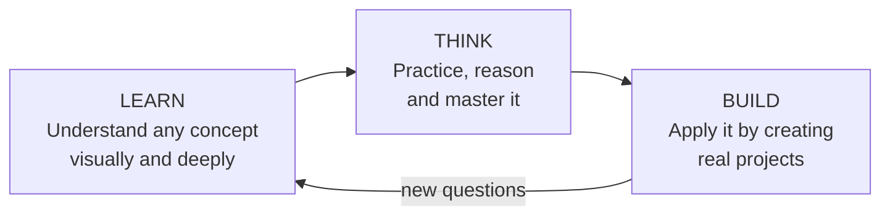
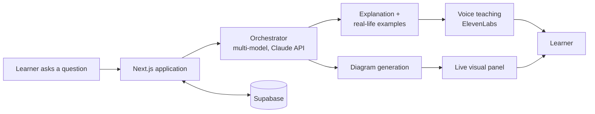

#  Ciro AI

**Learn. Think. Build.**

*An AI learning companion that teaches with live diagrams and real-life examples.*

 

Ciro explains concepts the way an excellent tutor would: visually, step by step, and grounded in the real world. It is engineered as a full system, not a single model call, and it is designed to grow from a tutor into a complete learning companion.

---

## 💡 The Idea Behind Ciro

Most students can find an answer in seconds. What they struggle to find is **understanding**: the moment a concept stops being a definition and starts making sense. Static videos and notes explain everything the same way to everyone, and chatbots return text that is easy to read and just as easy to forget.

Ciro is built on a different belief: **people understand when they can see an idea, interact with it, and connect it to something real.**

Every explanation in Ciro is:

- 🎨 **Visual:** a live diagram that builds as the explanation unfolds
- 🎛️ **Interactive:** controls the learner can change to watch the concept respond
- 🌍 **Grounded:** tied to everyday examples the learner has actually experienced
- 🧭 **Personal:** shaped by the learner's progress, goals and learning style

---

## ✨ What Ciro Does Today

- 🤖 **AI Tutor:** instant, step-by-step explanations in a conversational interface
- 📈 **Live Diagrams:** concepts visualized in real time, with interactive controls
- 🚌 **Real-life examples:** every idea tied to something familiar
- 🔊 **Voice teaching:** explanations narrated through ElevenLabs
- 🗂️ **Personalized dashboard:** continue-learning cards, a daily study plan, progress tracking and streaks
- 🎯 **Suggestion engine:** recommends topics, practice sets, notes and full learning paths from progress, goals and learning style
- 🧰 **Study tools:** practice questions, note summarization, test generation and a doubt solver

### Example: how a lesson plays out

> *Class 11 Physics, Newton's Laws of Motion, First Law (Inertia)*
>
> 1. **Concept:** the law stated in one clear line, with a highlighted key idea: objects resist any change in their state of motion.
> 2. **Interactive diagram:** a box at rest next to a box in motion, with a force slider so the learner can apply force and see what changes.
> 3. **Real-life examples:** a book resting on a table, passengers lurching forward when a bus brakes, a coin dropping into a glass when the card is flicked away.
> 4. **Key takeaways:** greater mass means greater inertia, which is why seat belts matter.
> 5. **Practice and notes:** one tap to practice questions, summary notes or the next law.

---

## 🚀 Where Ciro Is Headed

Ciro's tagline is also its roadmap. The product grows through three stages.

### The vision

A **personal AI learning companion** that knows where a learner stands, decides what they should learn next, teaches it in the way that works for them, checks that it stuck, and then helps them use it to build something real.

### Roadmap

| Stage | Focus | What it brings |
|---|---|---|
| **Now · Learn** | The teaching engine | AI tutor, live diagrams, real-life examples, voice teaching, personalized dashboard, suggestions and study tools |
| **Next · Think** | Adaptive and agentic learning | Agents that plan a learning path, generate practice, evaluate answers and adapt difficulty; richer interactive simulations; deeper progress analytics; more subjects and exam-focused paths |
| **Later · Build** | From knowing to making | Project-based learning with Ciro as a mentor (for example the AI and Machine Learning path, from Python to real AI projects); a launch-ready v1 product; wider reach through more languages and devices |

### Principles that will not change

- **Understanding over answers.** Ciro teaches the idea, not just the result.
- **Show, don't only tell.** If a concept can be visualized, it is.
- **The learner sets the pace.** Plans and difficulty adapt to the person.
- **Accessible by design.** Good teaching should not depend on who you can afford.

---

## 🏗️ Architecture

- **Dual-panel interface:** conversation on one side, a live visual explanation on the other
- **Streaming, animated content generation:** diagrams build as the explanation unfolds
- **Multi-model architecture:** orchestrated through the Claude API
- **Next.js and Supabase:** application and data layer

---

## 🧰 Stack

    

## 📌 Status

In active development. This repository showcases the product and its direction, and will be updated as Ciro AI evolves.

---

Built by [Manthan](https://github.com/ManthanDk27) · [LinkedIn](https://www.linkedin.com/in/manthan-dakkhankar-507083283)
